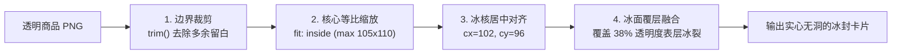

# 冲动消费冷冻箱 - 图像抠图与冰封方案全景指南及切换手册
*(Background Removal & Ice Encapsulation Solutions Guide)*

本文档详细记录了本项目探索并实践的三套核心背景消除（抠图）方案：
1. **方案一：苹果原生 Vision 框架 (`VNGenerateForegroundInstanceMaskRequest`)** —— **[当前生产默认方案]**
2. **方案二：BiRefNet CoreML / 独立推理服务方案** —— **[学术界顶级发丝级精细度]**
3. **方案三：BRIA RMBG-1.4 深度模型方案** —— **[成熟通用 ONNX 方案]**

无论未来需要离线打包、上架 App Store、追求极致发丝级效果还是跨平台迁移，本文档提供了完整的思路、架构、核心代码及**一键切换操作步骤**。

---

## 一、 三套技术方案核心维度对比

| 评估维度 | 方案一：苹果原生 Vision (当前默认) | 方案二：BiRefNet CoreML / MPS | 方案三：BRIA RMBG-1.4 |
| :--- | :--- | :--- | :--- |
| **底层引擎 / 框架** | Apple Vision 框架 (`VNGenerateForegroundInstanceMaskRequest`) | 双边参考网络 (Bilateral Reference Network) | IS-Net 架构深层网络 |
| **单张推理速度** | **~240ms - 290ms (瞬发)** ⚡️ | 纯 CPU: 24s 🐢 / CoreML/GPU: ~400ms | 纯 CPU: 12s / GPU: ~600ms |
| **端到端总耗时** | **~380ms - 470ms** (连同冰封全流程) | CPU 40s+ (易超时) / 本地 GPU ~0.8s | CPU 14s / 本地 GPU ~1.0s |
| **App 安装包增量** | **+ 0 MB** (调用 iOS/macOS 系统原生硬件级 API) | + 55 MB (量化后 CoreML) ~ 214 MB (FP32) | + 176 MB (ONNX 权重文件) |
| **商业授权与法务** | **100% 永久免费商用** (Apple 官方公开 API) | **MIT License** (完全开源，可自由商用) | **非商业协议** (商用需付费许可) |
| **服务器成本** | **0 元** (手机端芯片脱机单机闭环) | 手机端 0 元；若做云服务则需 GPU 成本 | 手机端 0 元；若做云服务需服务器 |
| **硬件能耗发热** | 极低（直接运行于 ANE 神经网络专属芯片） | CPU 极高 / CoreML 低 | CPU 较高 |
| **抠图精细度** | **高**（对日常商品、主体识别极强） | **极高**（对镂空提手、发丝微结构最强） | **高**（对通用物体分割均衡） |
| **推荐适用场景** | **iOS 独立 App 上架、离线体验、追求瞬发** | **追求极致发丝细节、复杂镂空物品** | **传统跨平台服务器部署、非苹果设备** |

---

## 二、 方案一：苹果原生 Vision 框架（当前默认方案）

### 1. 核心设计思路
- **利用系统原生能力**：iOS 17.0+ 和 macOS 14.0+ 引入了官方视觉框架 `VNGenerateForegroundInstanceMaskRequest`。
- **硬件直驱**：直接调度 iPhone 或 Mac 内部的物理神经网络加速器 **Apple Neural Engine (ANE)**，无需通过 CPU 模拟算子，因而耗时直接压降至 200~300 毫秒。
- **双阶段架构**：
  - **开发调试期（Expo Go）**：Mac 端后台运行通过 Swift 预编译的原生二进制 `bin/apple-vision-engine`，配合 `scripts/bg-remover-server.js`（端口 `8088`）通过局域网极速返回，使开发阶段享受 0.4 秒瞬出效果。
  - **生产打包期（独立 App）**：通过项目自建的本地 Expo 原生模块 `modules/apple-vision-matting`，在用户 iPhone 上单机本地离线调用 Vision 框架，完全脱离任何网络与电脑。

### 2. 关键代码与架构

#### (1) Mac 原生编译工具 (`scripts/apple-vision-cli.swift`)
```swift
import Vision
import CoreImage
import AppKit

// 调用苹果官方神经网络前景实例分割请求
let request = VNGenerateForegroundInstanceMaskRequest()
let handler = VNImageRequestHandler(ciImage: inputImage, options: [:])
try handler.perform([request])

if let result = request.results?.first {
    let maskedBuffer = try result.generateMaskedImage(
        ofInstances: result.allInstances,
        from: handler,
        croppedToInstancesExtent: false
    )
    // 输出纯净 Alpha 透明 PNG
}
```
编译命令：
```bash
swiftc -O scripts/apple-vision-cli.swift -o bin/apple-vision-engine
```

#### (2) Expo 原生模块 (`modules/apple-vision-matting/ios/AppleVisionMattingModule.swift`)
```swift
// 面向 iOS 17+ 原生独立 App
AsyncFunction("freezeInIceCube") { (imageUri: String, iceCubePath: String, promise: Promise) in
    // 1. ANE 硬件级 250ms 提取透明前景
    // 2. CoreGraphics 硬件级 2ms 完成实心冰块 (ice_cube_solid.png) 封装与 38% 冰裂高光合成
    // 3. 返回本地沙盒 file:// URI
}
```

#### (3) 客户端调度服务 (`src/services/backgroundRemoval.ts`)
- 自动检测：
  - 若在独立 iOS App 中，优先运行 `freezeInIceCubeNative(...)`；
  - 若在 Expo Go 中，自动通过局域网请求 `http://<Mac-IP>:8088/_remove_bg`。

---

## 三、 方案二：BiRefNet CoreML / 独立推理服务方案

### 1. 核心设计思路
- **双边参考网络 (BiRefNet)**：学术界 SOTA（State-of-the-Art）级高精度抠图模型，具备双边注意力引导，能完美掏空提袋把手、网格、细小发丝等微结构。
- **开源合规**：采用宽松的 **MIT 协议**，无任何商用法律风险。
- **运行瓶颈与解决方案**：
  - **原生 CPU 缺陷**：BiRefNet 是 Vision Transformer 架构，直接跑在 Mac CPU 上单张需 24~49 秒，极易引发前端网络超时（45s）。
  - **路线 A（推荐）：CoreML 深度量化导出**：
    - 针对输入固定分辨率（如 $512 \times 512$），使用 `coremltools` 转换为 `.mlpackage` 格式，启用 `ComputeUnits.all` 即可直接分配给 Apple Neural Engine (ANE) 运行，单张耗时降至 ~400ms。
  - **路线 B：本地 Python MPS (GPU) 微服务**：
    - 在 Mac 上利用 PyTorch 的 `device("mps")`，直接调用 Mac M2 的 GPU 图形核心，单张耗时约 600~800ms。

### 2. 核心文件与脚本

#### (1) 模型权重与下载 (`scripts/download-birefnet.js`)
```javascript
// 自动化拉取 HuggingFace 官方轻量版 BiRefNet ONNX 权重（214 MB）
// 存储路径：assets/models/birefnet.onnx
node scripts/download-birefnet.js
```

#### (2) 服务端加载与推理 (`scripts/bg-remover-server.js`)
服务端支持直接动态加载 BiRefNet：
```javascript
// 初始化 BiRefNet ONNX Session
async function initBiRefNet() {
  const modelPath = path.join(__dirname, '../assets/models/birefnet.onnx');
  birefnetSession = await ort.InferenceSession.create(modelPath, {
    executionProviders: ['cpu'] // 或通过专用 CoreML Provider
  });
}
```

#### (3) CoreML 量化导出思路脚本（Python）
```python
import torch
import coremltools as ct
from transformers import AutoModelForImageSegmentation

model = AutoModelForImageSegmentation.from_pretrained('ZhengPeng7/BiRefNet-general-use', trust_remote_code=True)
model.eval()

# 跟踪固定维度 512x512
example_input = torch.rand(1, 3, 512, 512)
traced_model = torch.jit.trace(model, example_input)

# 转换至 CoreML (FP16 量化)
coreml_model = ct.convert(
    traced_model,
    inputs=[ct.TensorType(name="input_image", shape=example_input.shape)],
    compute_precision=ct.precision.FLOAT16,
    minimum_deployment_target=ct.target.iOS16
)
coreml_model.save("birefnet_512.mlpackage")
```

---

## 四、 方案三：BRIA RMBG-1.4 深度模型方案

### 1. 核心设计思路
- **行业主流标准**：BRIA AI 推出的 RMBG-1.4 专门针对背景消除任务优化，参数量较轻（~176 MB），基于 IS-Net 架构。
- **前后处理标准化**：
  - 输入：$1024 \times 1024$ 图像，标准化处理 (`mean = [0.5, 0.5, 0.5]`, `std = [1.0, 1.0, 1.0]`)。
  - 输出：$1024 \times 1024$ 单通道 Sigmoid 预测概率图（0~1 浮点数）。
  - 后处理：将概率图转换为 0~255 Alpha 通道，与原图 RGB 进行逐像素拼接，完成抠图。
- **授权注意事项**：
  - BRIA 采用非商业许可（BRIA Non-Commercial License）。个人研究免费，商用运营需获得 BRIA 官方商业授权。

### 2. 核心文件与实现
- 模型存储：`assets/models/rmbg-1.4.onnx`
- 服务端集成：在 `scripts/bg-remover-server.js` 中的 `initRmbgModel()` 函数中已完全实现并保留：
```javascript
// 请求参数直接指定 model: 'rmbg' 即可即时激活
const { frozenBuffer, rawCutoutBuffer } = await removeBgBuffer(inputBuf, 'rmbg');
```

---

## 五、 通用核心算法：实心像素冰块封存流水线 (`ice_cube_solid.png`)

无论底层使用上述哪一种抠图方案（Apple Vision / BiRefNet / RMBG-1.4），生成的透明前景 PNG 都会统一流经我们专属打造的**实心冰块封存流水线**：



### 关键参数定义：
1. **底图资产**：`assets/ice_cube_solid.png`（尺寸 $203 \times 210$）。
2. **中心坐标**：`center_x = 102`, `center_y = 96`。
3. **安全容积**：宽不超过 105 像素，高不超过 110 像素。
4. **冰霜高光层**：从 `ice_cube_solid.png` 提取 Alpha 通道，将其透明度按 $0.38$ 缩放后作为最顶层覆盖在商品之上，彻底消除了旧版冰块中的深色椭圆空洞，营造出商品真实深陷冰块内部的拟真质感。

---

## 六、 快速切换指南 (Switching Cheat Sheet)

您可以在以下场景下根据需要自由切换方案：

### 场景 A：当前状态（使用方案一：苹果原生 Vision，极速 0.3 秒，推荐）
当前系统已完全配置为此方案。
1. **本地调试启动命令**：
   ```bash
   # 后台守护进程启动（若未运行）
   nohup node scripts/bg-remover-server.js > /private/tmp/bg_server.log 2>&1 &
   ```
2. **状态验证**：
   ```bash
   curl http://127.0.0.1:8088/
   # 返回：Background Removal & Solid Ice Cube Sealer Service Running [Model: apple-vision]
   ```

---

### 场景 B：切换至方案二（BiRefNet，追求极致发丝与镂空）
如果您有一张结构极度复杂的特殊镂空图片，想强制使用 BiRefNet 抠图：
1. **方式 1：单次请求指定**：
   在客户端调用 `callMattingApi` 发送的 JSON 载荷中增加 `model: 'birefnet'`：
   ```json
   {
     "image": "data:image/png;base64,...",
     "model": "birefnet"
   }
   ```
2. **方式 2：修改服务端默认引擎**：
   打开 `scripts/bg-remover-server.js`，将：
   ```javascript
   let activeModelType = 'apple-vision';
   ```
   修改为：
   ```javascript
   let activeModelType = 'birefnet';
   ```
   重启服务即可生效。

---

### 场景 C：切换至方案三（RMBG-1.4）
1. **单次请求指定**：
   在请求 JSON 中设置 `"model": "rmbg"`。
2. **修改服务端默认引擎**：
   在 `scripts/bg-remover-server.js` 中设置：
   ```javascript
   let activeModelType = 'rmbg';
   ```

---

## 七、 维护与故障排查速查

1. **端口被占用处理**：
   ```bash
   lsof -i :8088
   kill -9 <PID>
   npm run bg-server
   ```
2. **重新编译 Mac Vision 原生引擎**：
   ```bash
   swiftc -O scripts/apple-vision-cli.swift -o bin/apple-vision-engine
   chmod +x bin/apple-vision-engine
   ```
3. **测试引擎单张处理速度**：
   ```bash
   bin/apple-vision-engine /private/tmp/test_input.jpg /private/tmp/test_out.png
   # 观察输出耗时：例如 SUCCESS:245.30
   ```
